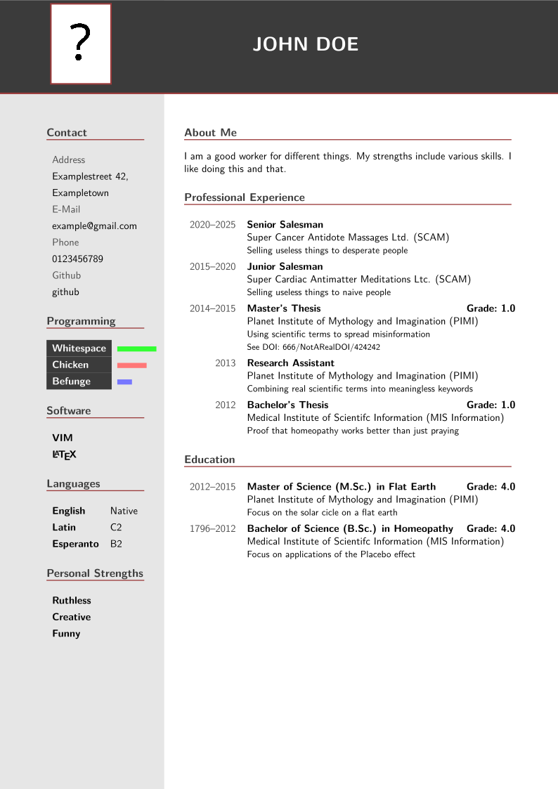

## Curriculum Vitae LaTeX Class and JSON-to-LaTeX-Converter (Python)

Provides a LaTeX class for a curriculum vitae called `medercv2025`.
[`medercv2025_creator.py`](medercv2025_creator.py) provides a python dataclass and a converter so you can write your curriculum vitae in JSON and convert it to LaTeX later.

See the example in [`example_cv.json`](example_cv.json) that can be converted as follows:
```python
import medercv2025_creator as cv_creator

# Load curriculum vitae from json
curriculum_vitae = cv_creator.load("example_cv.json")
# Convert the curriculum vitae to LaTeX and save it
cv_creator.save(curriculum_vitae, "example_cv.tex")
```
The output looks like this:

